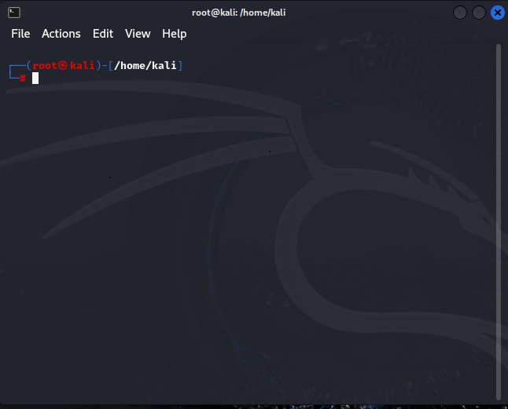
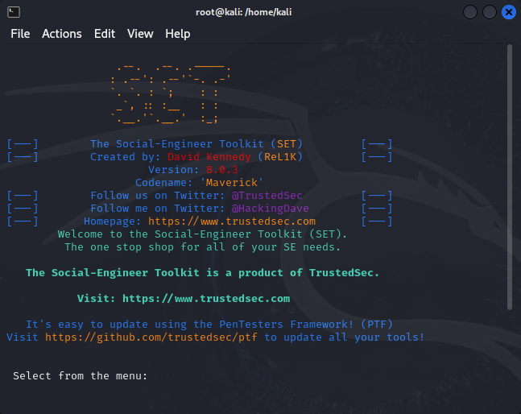
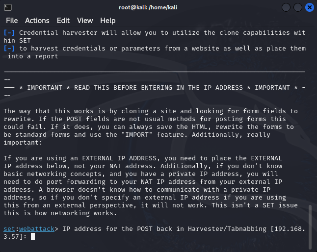
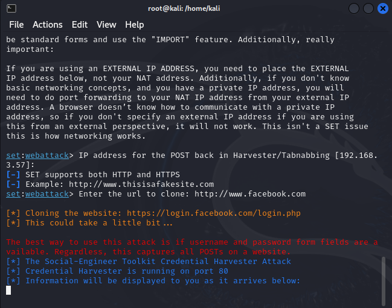
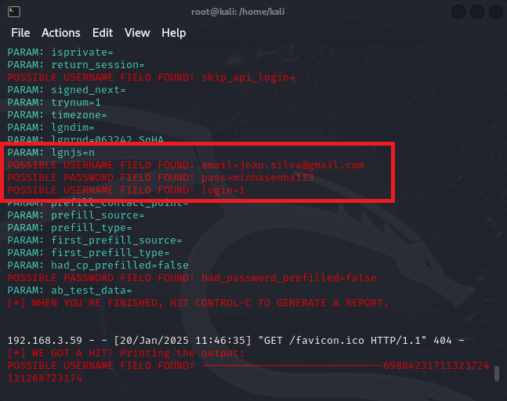

# Capturando senhas do Facebook por meio de um Phishing

### Ferramentas necessárias

- Máquina virtual Kali Linux 
- setoolkit

### Passo a passo

- Acessar o terminal 
- Permitir acesso como administrador: ``` sudo su ```
  
- Inserir a senha da administrador
- Iniciar o setoolkit pelo comando: ``` setoolkit ```
  
- Escolher o tipo de ataque que deseja: ``` Social-Engineering Attacks ```
- Vetor de ataque: ``` Web Site Attack Vectors ```
- Método de ataque: ```Credential Harvester Attack Method ```
  
- Método de ataque: ``` Site Cloner ```
- Quando selecionar o tipo de ataque, vetor e método, seu IP será o ultimo parametro da mensagem, caso deseje usa-lo, somente aperte enter
- Caso não encontre o IP, é possível obter em outra aba do terminal com o comando: ``` ifconfig ```
- Digite a URL do site que deseja clonar, nesse caso usarei a do Facebook (atente para usar o método HTTP): http://www.facebook.com
  
### Resutados



### Problemas encontrados e solução

Ao acessar o IP por meio da minha máquina real, tanto para aba anônima ou não, não houve o redirecionamento para o site do Facebook nem a captura das informações desejadas, creio que pela segurança do navegador atual e politica de CORS que não permitia o redirecionamento.
- Solução: 
  - Use uma máquina virtual W7 ou XP
  - Acesse o IP da máquina virtual Kali Linux em um navegador IE (Internet Explorer)
  - Inserir as informações de login e senha
